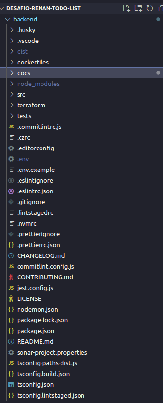

# Estrutura Organizacional do Código do Backend do Todo List

## Visão Geral

Este documento explica como organizei a estrutura do código do backend do Todo List. A disposição dos diretórios e arquivos foi pensada para refletir claramente as diferentes camadas da arquitetura, separando as responsabilidades e tornando mais fácil entender e gerenciar o código.

## Organização dos Diretórios e Arquivos

A estrutura do projeto está montada para mostrar as camadas de arquitetura e separar as diferentes partes do código. Aqui está a disposição dos principais diretórios:

- **/src - Diretório Raiz:**
  - **/data:** Aqui ficam os módulos que lidam com dados, incluindo acesso a bancos, repositórios e toda lógica relacionada à guarda e recuperação de dados.
  - **/domain:** É o coração do sistema, com as entidades, regras de negócio e interfaces de repositório. Este diretório mostra o modelo do domínio e fica isolado de influências externas.
  - **/infra:** Cuida dos detalhes técnicos para o sistema rodar, como configuração de bancos, comunicação com serviços externos e implementações concretas das interfaces do domínio.
  - **/main:** É o ponto de entrada da aplicação, contendo a configuração inicial, servidor HTTP, rotas e a inicialização de serviços essenciais.
  - **/presentation:** Trata da camada de apresentação, gerenciando requisições e respostas, definindo controladores, rotas e qualquer lógica voltada para interação com o usuário ou serviços externos.

## Explicação da Estrutura

A estrutura foi pensada para facilitar o desenvolvimento e a manutenção do sistema. Aqui estão os pontos-chave sobre a organização:

- **Separação de Preocupações:** Cada diretório tem um papel bem definido, diminuindo o acoplamento e aumentando a clareza. Isso torna mais fácil entender o código e facilita a manutenção e o crescimento do sistema.
- **Refletindo a Arquitetura:** A organização espelha a arquitetura Clean e DDD que escolhemos, com distinção clara entre domínio, aplicação, infraestrutura e apresentação. Isso assegura que o código de negócios fique isolado de detalhes técnicos e frameworks.
- **Modularidade:** O código é modular, com componentes e funcionalidades agrupados de forma lógica. Isso permite a reutilização de código, a substituição fácil de partes do sistema e um melhor gerenciamento das dependências.
- **Escalabilidade:** A estrutura está pronta para crescer junto com o projeto. É possível adicionar novos componentes, serviços e módulos de forma organizada, mantendo a base de código compreensível e fácil de lidar.

## Conclusão

A organização do código do backend do Todo List foi feita pensando em claridade, manutenção e escalabilidade.

